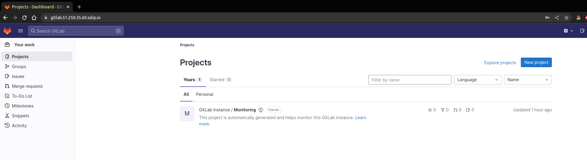
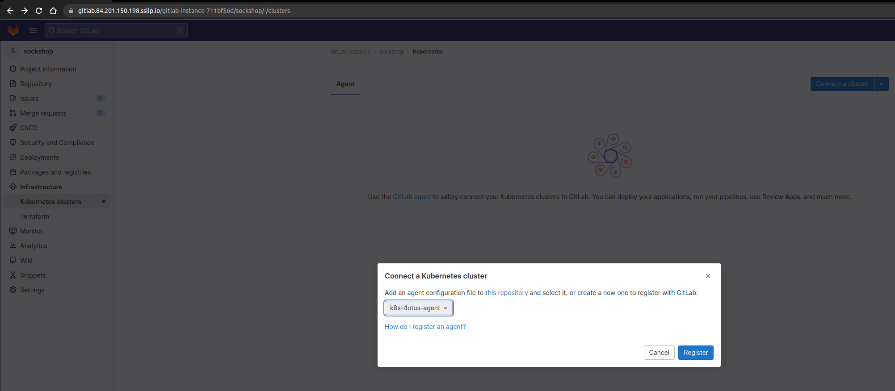
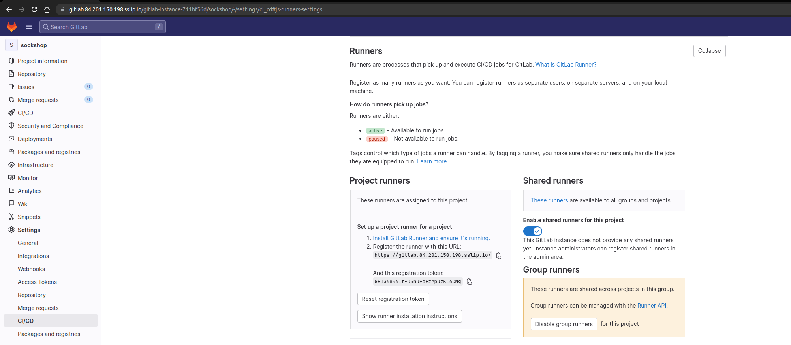
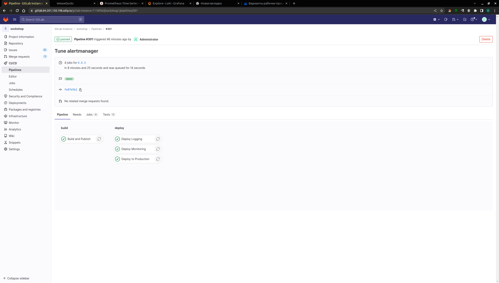
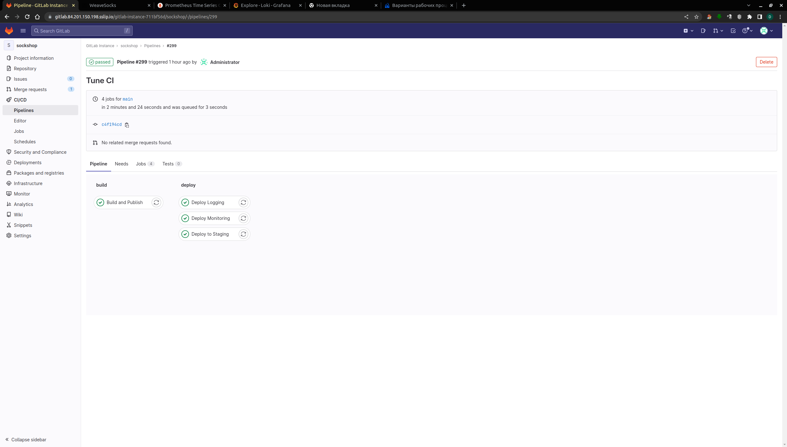
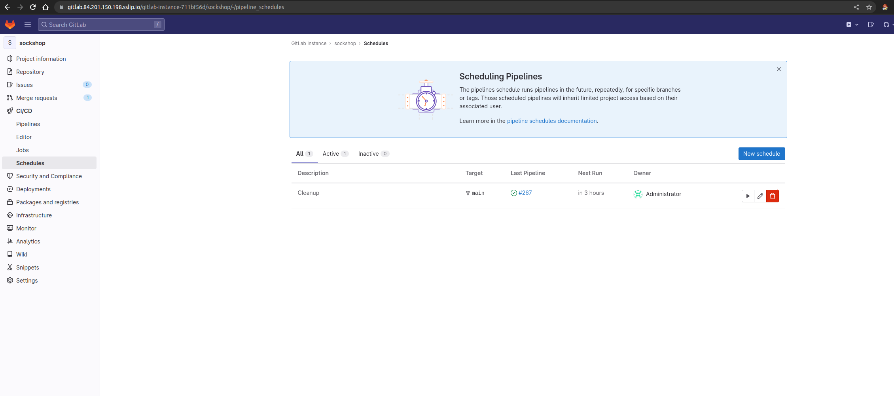
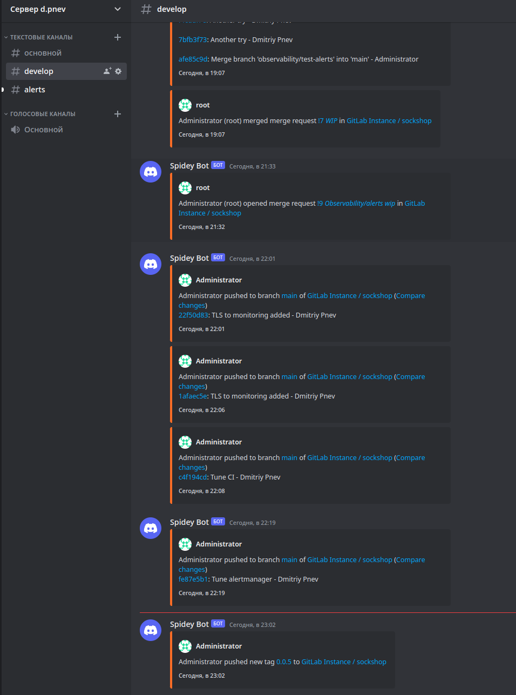
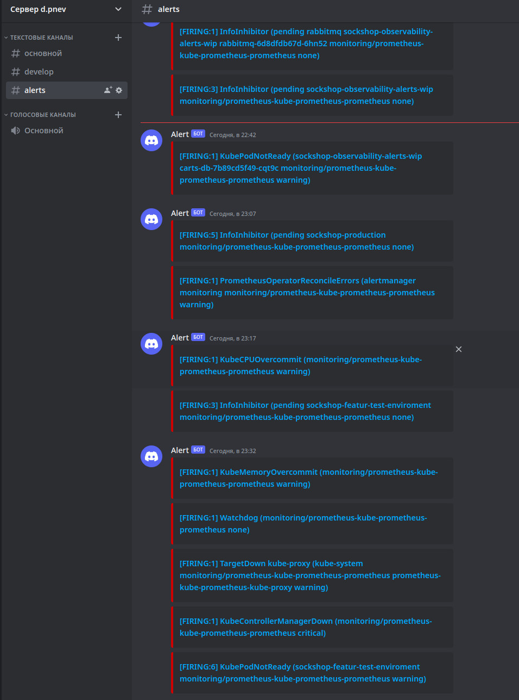

# sock-shop
Sock Shop : A Microservice Demo Application. https://github.com/otus-kuber-2022-12 graduation project.

## Services

Для запуска приложения был реализован CI/CD сервисов:

| Name           | Language/Framework/Databse | Comments                                                                                                                                                                                                                     |
|:---------------|:---------------------------|:-----------------------------------------------------------------------------------------------------------------------------------------------------------------------------------------------------------------------------|
| `carts`        | `Java`                     | Важно! При успешной сборке, сервис `carts` валился с ошибкой при деплое. Для успешного запуска необходимо сделать реверт коммита https://github.com/microservices-demo/carts/commit/16b28bc773460bc24d0287dad5e0e0806f7b37ef |
| `catalogue`    | `Go`                       |                                                                                                                                                                                                                              |
| `catalogue-db` | `MySQL`                    |                                                                                                                                                                                                                              |
| `front-end`    | `Node.js`                  |                                                                                                                                                                                                                              |
| `orders`       | `Java`                     |                                                                                                                                                                                                                              |
| `queue-master` | `Java`                     |                                                                                                                                                                                                                              |
| `payment`      | `Go`                       |                                                                                                                                                                                                                              |
| `user`         | `Go`                       |                                                                                                                                                                                                                              |
| `user-db`      | `MongoDB`                  |                                                                                                                                                                                                                              |

# Ресурсы проекта
| Resource                             | URL                                                                      | Credentinals          |
|:-------------------------------------|:-------------------------------------------------------------------------|:----------------------|
| `GitLab 15.10.3`                     | https://gitlab.84.201.150.198.sslip.io/gitlab-instance-711bf56d/sockshop | otus:m5GScszUiThWzNv  |
| `Sock Shop` - окружение 'production' | https://sockshop-production.51.250.91.225.sslip.io/                     |                       |
| `Sock Shop` - окружение 'stage'      | https://sockshop-staging.51.250.91.225.sslip.io/                        |                       |
| `Sock Shop` - окружение 'review'     | https://[по имени ветки].51.250.91.225.sslip.io/                        |                       |
| `Prometheus`                         | https://prometheus.51.250.91.225.sslip.io/                              |                       |
| `Alertmanager`                       | https://alertmanager.51.250.91.225.sslip.io/#/alerts                    |                       |
| `Grafana`                            | https://grafana.51.250.91.225.sslip.io/                                 | otus:m5GScszUiThWzNv  |
| `Loki`                               | https://grafana.51.250.91.225.sslip.io/explore?orgId=1                  | otus:m5GScszUiThWzNv  |

# CI 

- Загрузка и обновление сабмодулей
~~~bash
git submodule update --init --recursive
~~~

- Для запуска локальной сборки и проверки CI необходима установка утилиты werf 1.2
> https://ru.werf.io/installation.html?version=1.2&channel=stable&os=linux&arch=amd64&method=installer

- Установка werf (Linux). Инструкции по установке на других ОС приведены по ссылке выше.
~~~bash
curl -sSLO https://werf.io/install.sh && chmod +x install.sh
./install.sh --version 1.2 --channel stable
~~~

После активации werf должен быть доступен в той же shell-сессии, в которой он был активирован:
~~~bash
werf version
~~~

- Запуск локальной сборки с формированием отчета о результатах: `.werf-build-report.json`
~~~bash
werf build --save-build-report --dev
cat .werf-build-report.json 
~~~

~~~json
{
	"Images": {
		"carts": {
			"WerfImageName": "carts",
			"DockerRepo": "sockshop",
			"DockerTag": "d4cb82396f2d9ed5bafdf38e4751f2e089152af107e8cb5d79563b83-1681712250270",
			"DockerImageID": "sha256:1a3ece61b32c2bc1248463c0487c5538e04caf95693cd20eefcd844a88d5d6a9",
			"DockerImageDigest": "",
			"DockerImageName": "sockshop:d4cb82396f2d9ed5bafdf38e4751f2e089152af107e8cb5d79563b83-1681712250270",
			"Rebuilt": false
		},
		"catalogue": {
			"WerfImageName": "catalogue",
			"DockerRepo": "sockshop",
			"DockerTag": "4cf6891b7cc7402badabbacfdc91047161042e1d5d4cb4047ce0fd6a-1681712050698",
			"DockerImageID": "sha256:90aebc7f694c82e7a054fd09395dadd0be3a1afaf7b2ec22d8da341f5464c6c8",
			"DockerImageDigest": "",
			"DockerImageName": "sockshop:4cf6891b7cc7402badabbacfdc91047161042e1d5d4cb4047ce0fd6a-1681712050698",
			"Rebuilt": false
		},
		"catalogue-db": {
			"WerfImageName": "catalogue-db",
			"DockerRepo": "sockshop",
			"DockerTag": "fde0bb87297b6ac12f0c42a76079d1e286b6ff5efe200ba7febff0c7-1681711496367",
			"DockerImageID": "sha256:ab7f2837d60630e1200542362be3226647400b03af4f5076f531104156f67aa1",
			"DockerImageDigest": "",
			"DockerImageName": "sockshop:fde0bb87297b6ac12f0c42a76079d1e286b6ff5efe200ba7febff0c7-1681711496367",
			"Rebuilt": false
		},
		"front-end": {
			"WerfImageName": "front-end",
			"DockerRepo": "sockshop",
			"DockerTag": "0e630d9f7b9939db6c3fd212c30c00e33a387bd41b1c69eacfec496c-1681712067360",
			"DockerImageID": "sha256:3ebf75b457728473c39a2c95f24f3a39d9e5be0d4ca4dc97573359e5157245b0",
			"DockerImageDigest": "",
			"DockerImageName": "sockshop:0e630d9f7b9939db6c3fd212c30c00e33a387bd41b1c69eacfec496c-1681712067360",
			"Rebuilt": false
		},
		"orders": {
			"WerfImageName": "orders",
			"DockerRepo": "sockshop",
			"DockerTag": "5a2767a9d534d59297ae26867e1240b4bc85a282ce55bcad6deeba1d-1681711938547",
			"DockerImageID": "sha256:09dae08b453cef4f02fe5d24062f3c76eb3548a41a952aaacf6d38b0beb3d135",
			"DockerImageDigest": "",
			"DockerImageName": "sockshop:5a2767a9d534d59297ae26867e1240b4bc85a282ce55bcad6deeba1d-1681711938547",
			"Rebuilt": false
		},
		"payment": {
			"WerfImageName": "payment",
			"DockerRepo": "sockshop",
			"DockerTag": "faebee07e35cf3a8b196e6225e13cfeba1b4ceda6cffdecf4ca2fbfe-1681712371307",
			"DockerImageID": "sha256:e37587b0dc9032a867d5caf290b9256a74c719cd12897f3de11b89fbcdebfea0",
			"DockerImageDigest": "",
			"DockerImageName": "sockshop:faebee07e35cf3a8b196e6225e13cfeba1b4ceda6cffdecf4ca2fbfe-1681712371307",
			"Rebuilt": false
		},
		"queue-master": {
			"WerfImageName": "queue-master",
			"DockerRepo": "sockshop",
			"DockerTag": "5a6d61ed62cb6c39a9e91e32d83039be317e62681877802d456d5764-1681712370943",
			"DockerImageID": "sha256:173d0f6461ed57bbc27859ace25709b006c136aa8a2f95dc8b1321f2bb5d0f0e",
			"DockerImageDigest": "",
			"DockerImageName": "sockshop:5a6d61ed62cb6c39a9e91e32d83039be317e62681877802d456d5764-1681712370943",
			"Rebuilt": false
		},
		"shipping": {
			"WerfImageName": "shipping",
			"DockerRepo": "sockshop",
			"DockerTag": "0a9564d15a03f03e2176e4747465395300520c49852e066c7a520df8-1681711932222",
			"DockerImageID": "sha256:3d8d9553952f5674f5cfd94d92a86c25894f47bbfcc42b994359909161c0745b",
			"DockerImageDigest": "",
			"DockerImageName": "sockshop:0a9564d15a03f03e2176e4747465395300520c49852e066c7a520df8-1681711932222",
			"Rebuilt": false
		},
		"user": {
			"WerfImageName": "user",
			"DockerRepo": "sockshop",
			"DockerTag": "56198e26cd27c9eab66ca49b14e90e4774936977605847a3d88d187d-1681711745271",
			"DockerImageID": "sha256:e049a72d5695fffc01b730620159f19ac8411d8f29439809b87a81ad6e1c464b",
			"DockerImageDigest": "",
			"DockerImageName": "sockshop:56198e26cd27c9eab66ca49b14e90e4774936977605847a3d88d187d-1681711745271",
			"Rebuilt": false
		},
		"user-db": {
			"WerfImageName": "user-db",
			"DockerRepo": "sockshop",
			"DockerTag": "c35a367357b7eb785befdce74d627df3fdfa861b7a7e5799d93030d6-1681711435254",
			"DockerImageID": "sha256:8448172d5a9fdac58d7dd13a3ae5534a348e3b90f398ab2e2846fb22e984e905",
			"DockerImageDigest": "",
			"DockerImageName": "sockshop:c35a367357b7eb785befdce74d627df3fdfa861b7a7e5799d93030d6-1681711435254",
			"Rebuilt": false
		}
	},
	"ImagesByPlatform": {}
}
~~~

# Развертывание кластера K8s с автоскалингом от 2 до 6 нод
~~~bash
cd terraform-k8s
terraform init
terraform apply --auto-approve
~~~

- Резервирование внешнего IP LoadBalancer
~~~bash
kubectl get svc -n nginx-ingress
yc vpc address list                                       
yc vpc address update --reserved=true e9bj67r5dhu6rgimdm4g
~~~

# Развертывание виртуальной машины с инстансом GitLab CI/CD версии 15.10.3 

> https://cloud.yandex.com/en-ru/docs/tutorials/infrastructure-management/gitlab-containers

~~~bash
cd gitlab-ci/terraform
terraform init
terraform apply --auto-approve
yc compute instance list | grep gitlab
yc vpc address list 
~~~

~~~bash
yc vpc address update --reserved=true b0cbp5ihggpv7p7d4tf3
ssh ubuntu@84.201.150.198 -i ~/.ssh/appuser
~~~

- Ставим ssl по https://docs.gitlab.com/omnibus/settings/ssl/

> https://gitlab.84.201.150.198.sslip.io/

# Установка GitLab Agent 

> https://cloud.yandex.ru/docs/managed-kubernetes/operations/applications/gitlab-agent
> https://docs.gitlab.com/ee/user/clusters/agent/install/

- Берем токен для установки GitLab Agent `k8s-4otus-agent` в соответствии с содержимым [.gitlab/agents/k8s-4otus-agent/config.yaml](.gitlab/agents/k8s-4otus-agent/config.yaml)

- Прописываем полученный токен в установку 
~~~bash
helm repo add gitlab https://charts.gitlab.io
helm repo update gitlab
helm upgrade --install k8s-4otus-agent gitlab/gitlab-agent \
    --namespace gitlab-agent-k8s-4otus-agent \
    --create-namespace \
    --set image.tag=v15.10.0 \
    --set config.token='TOKEN' \
    --set config.kasAddress=wss://gitlab.84.201.150.198.sslip.io/-/kubernetes-agent/
~~~

~~~bash
kubectl get pods --namespace gitlab-agent-k8s-4otus-agent
~~~
~~~console
NAME                                            READY   STATUS    RESTARTS   AGE
k8s-4otus-agent-gitlab-agent-7dc7d95b7c-8qv9l   1/1     Running   0          36s
~~~

# Установка GitLab Runner

- Забираем токен для установки раннера

~~~bash
helm repo add gitlab https://charts.gitlab.io
~~~

- Производим установку раннера в нашем кластере k8s для исполнения джобов CI/CD
~~~bash
export RUNNER_TOKEN=`GR1348941TzZ-VMohax6aBhy7pwAy`
helm upgrade --install --namespace default gitlab-runner -f gitlab-ci/runner/values.yaml --set runnerRegistrationToken=$RUNNER_TOKEN gitlab/gitlab-runner
~~~
~~~bash
kubectl get pods -n default | grep gitlab-runner
~~~
~~~console
gitlab-runner-9765bc5f8-lzqlb   1/1     Running   0          2m23s
~~~

# Описание конфигурации рабочего процесса CI/CD

В проекте реализован классический метод создания релизов только после активной фазы разработки.

| Окружение    | Описание рабочего процесса                                                      |
|:-------------|:--------------------------------------------------------------------------------|
| `Production` | Развёртывание на production из тега автоматически                               |
| `Staging`    | Развёртывание на staging из master автоматически                                |
| `Review`     | Развёртывание на review из pull request автоматически после ручной активации    |

### Развёртывание на production из тега автоматически
Создание нового тега автоматически вызывает pipeline развёртывания на production-окружение из коммита, связанного с этим тегом.
Варианты отката:
- Рекомендованный: средствами CI/CD системы, повторный ручной вызов pipeline на старом теге.
- Создание нового тега на старый коммит, далее автоматический вызов pipeline развёртывания для нового тега. Не предпочтительный вариант, т.к. плодятся лишние теги.

### Развёртывание на staging из master автоматически
Merge или коммит в ветку master вызывает pipeline развёртывания непосредственно на staging окружение.
Состояние ветки в любой момент времени отражает состояние окружения. Поэтому данный вариант является соответствующим подходу true CI/CD.

Варианты отката:
- Рекомендованный: откат через реверт коммита в ветке master. В этом случае поддерживается состояние ветки в синхронизированном с окружением состоянии, поэтому это предпочтительный вариант для сохранения целостности схемы.
- Средствами CI/CD системы, повторный ручной вызов pipeline на старом коммите (например, в Gitlab CI кнопка “откатить” по факту выполняет именно эти шаги).

### Развёртывание на review из pull request автоматически после ручной активации   
Pipeline развёртывания в review-окружение может быть запущен вручную только на коммите из ветки соответствующей этому окружению. Название этого окружения связано с именем ветки. Запуск pipeline производится средствами CI/CD системы вручную: кнопка в CI/CD системе, повесить label или вызов API.

Варианты отката:

- Рекомендованный: средствами CI/CD системы, повторный ручной вызов pipeline на старом коммите (например, в Gitlab CI кнопка “откатить” по факту выполняет именно эти шаги).
- Реверт коммита в ветке, затем запуск pipeline средствами CI/CD системы вручную: кнопка в CI/CD системе или вызов API. В данном случае вариант не рекомендован, т.к. состояние ветки не всегда соответствует состоянию окружения (в отличие от вариантов “автоматом для pull-request” и “автоматом для pull-request по паттерну”), поэтому создавать лишний revert не имеет большого смысла именно для задачи отката.

**Удаление review-окружения:**

- По закрытию или принятию PR.
- Автоматически по истечению time-to-live с последнего развёртывания на данное окружение (другими словами, при отсутствии активности в данном окружении).

# Очистка образов
> https://ru.werf.io/documentation/v1.2/usage/cleanup/cr_cleanup.html
 
В werf встроен эффективный механизм очистки, который позволяет избежать переполнения container registry и диска сборочного узла от устаревших и неиспользуемых образов.

Чтобы использовать очистку, необходимо создать Personal Access Token в GitLab с необходимыми правами. 
С помощью данного токена будет осуществляться авторизация в container registry перед очисткой.

Создадим Personal Access Token в нашей учетной записи GitLab. 
Для этого откроем страницу Settings в GitLab (настройки вашего профиля), затем откроем раздел Access Token. 
Укажем имя токена, в разделе Scope отметим api и нажмем Create personal access token — получимPersonal Access Token.

Чтобы передать Personal Access Token в переменную окружения GitLab откроем наш проект, затем откроем Settings —> CI/CD и развернем Variables. 
Создадим новую переменную окружения `WERF_IMAGES_CLEANUP_PASSWORD` и в качестве ее значения укажем содержимое Personal Access Token. 
Для безопасности отметим созданную переменную как protected.

Стадия очистки запускается только по расписанию, которое можем определить открыв раздел CI/CD —> Schedules настроек проекта в GitLab

# ChatOPS

В ходе проекта настроена интеграция GitLab и Discord

# Alerting

В ходе проекта настроена интеграция AlertManager и Discord

### Полезное

> https://habr.com/ru/companies/flant/articles/597277/

Stop
~~~bash
yc compute instance stop gitlab-ci-vm-0
yc managed-kubernetes cluster stop k8s-4otus
~~~

Start
~~~bash
yc compute instance start gitlab-ci-vm-0
yc managed-kubernetes cluster start k8s-4otus
~~~
