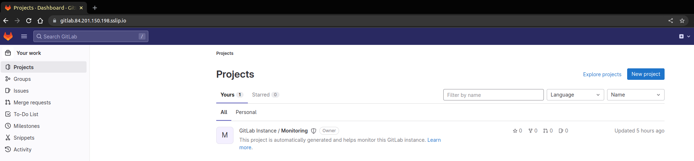

# sock-shop
Sock Shop : A Microservice Demo Application. https://github.com/otus-kuber-2022-12 graduation project.

## Services

1. carts (Java)
2. catalogue (Go)
3. catalogue-db (MySQL)
4. front-end (Node.js)
5. orders (Java)
6. queue-master (Java)
7. shipping (Java)
8. payment (Go)
9. user (Go)
10. user-db (Mongo)

# CI 

- Загрузка и обновление сабмодулей
~~~bash
git submodule update --init --recursive
~~~

- Для запуска локальной сборки и проверки CI необходима установка утилиты werf 1.2
> https://ru.werf.io/installation.html?version=1.2&channel=stable&os=linux&arch=amd64&method=installer

- Установка werf (Linux). Инструкции по установке на других ОС приведены по ссылке выше.
~~~bash
curl -sSLO https://werf.io/install.sh && chmod +x install.sh
./install.sh --version 1.2 --channel stable
~~~

После активации werf должен быть доступен в той же shell-сессии, в которой он был активирован:
~~~bash
werf version
~~~

- Запуск локальной сборки
~~~bash
werf build --save-build-report --dev
cat .werf-build-report.json 
~~~

~~~json
{
	"Images": {
		"carts": {
			"WerfImageName": "carts",
			"DockerRepo": "sockshop",
			"DockerTag": "d4cb82396f2d9ed5bafdf38e4751f2e089152af107e8cb5d79563b83-1681712250270",
			"DockerImageID": "sha256:1a3ece61b32c2bc1248463c0487c5538e04caf95693cd20eefcd844a88d5d6a9",
			"DockerImageDigest": "",
			"DockerImageName": "sockshop:d4cb82396f2d9ed5bafdf38e4751f2e089152af107e8cb5d79563b83-1681712250270",
			"Rebuilt": false
		},
		"catalogue": {
			"WerfImageName": "catalogue",
			"DockerRepo": "sockshop",
			"DockerTag": "4cf6891b7cc7402badabbacfdc91047161042e1d5d4cb4047ce0fd6a-1681712050698",
			"DockerImageID": "sha256:90aebc7f694c82e7a054fd09395dadd0be3a1afaf7b2ec22d8da341f5464c6c8",
			"DockerImageDigest": "",
			"DockerImageName": "sockshop:4cf6891b7cc7402badabbacfdc91047161042e1d5d4cb4047ce0fd6a-1681712050698",
			"Rebuilt": false
		},
		"catalogue-db": {
			"WerfImageName": "catalogue-db",
			"DockerRepo": "sockshop",
			"DockerTag": "fde0bb87297b6ac12f0c42a76079d1e286b6ff5efe200ba7febff0c7-1681711496367",
			"DockerImageID": "sha256:ab7f2837d60630e1200542362be3226647400b03af4f5076f531104156f67aa1",
			"DockerImageDigest": "",
			"DockerImageName": "sockshop:fde0bb87297b6ac12f0c42a76079d1e286b6ff5efe200ba7febff0c7-1681711496367",
			"Rebuilt": false
		},
		"front-end": {
			"WerfImageName": "front-end",
			"DockerRepo": "sockshop",
			"DockerTag": "0e630d9f7b9939db6c3fd212c30c00e33a387bd41b1c69eacfec496c-1681712067360",
			"DockerImageID": "sha256:3ebf75b457728473c39a2c95f24f3a39d9e5be0d4ca4dc97573359e5157245b0",
			"DockerImageDigest": "",
			"DockerImageName": "sockshop:0e630d9f7b9939db6c3fd212c30c00e33a387bd41b1c69eacfec496c-1681712067360",
			"Rebuilt": false
		},
		"orders": {
			"WerfImageName": "orders",
			"DockerRepo": "sockshop",
			"DockerTag": "5a2767a9d534d59297ae26867e1240b4bc85a282ce55bcad6deeba1d-1681711938547",
			"DockerImageID": "sha256:09dae08b453cef4f02fe5d24062f3c76eb3548a41a952aaacf6d38b0beb3d135",
			"DockerImageDigest": "",
			"DockerImageName": "sockshop:5a2767a9d534d59297ae26867e1240b4bc85a282ce55bcad6deeba1d-1681711938547",
			"Rebuilt": false
		},
		"payment": {
			"WerfImageName": "payment",
			"DockerRepo": "sockshop",
			"DockerTag": "faebee07e35cf3a8b196e6225e13cfeba1b4ceda6cffdecf4ca2fbfe-1681712371307",
			"DockerImageID": "sha256:e37587b0dc9032a867d5caf290b9256a74c719cd12897f3de11b89fbcdebfea0",
			"DockerImageDigest": "",
			"DockerImageName": "sockshop:faebee07e35cf3a8b196e6225e13cfeba1b4ceda6cffdecf4ca2fbfe-1681712371307",
			"Rebuilt": false
		},
		"queue-master": {
			"WerfImageName": "queue-master",
			"DockerRepo": "sockshop",
			"DockerTag": "5a6d61ed62cb6c39a9e91e32d83039be317e62681877802d456d5764-1681712370943",
			"DockerImageID": "sha256:173d0f6461ed57bbc27859ace25709b006c136aa8a2f95dc8b1321f2bb5d0f0e",
			"DockerImageDigest": "",
			"DockerImageName": "sockshop:5a6d61ed62cb6c39a9e91e32d83039be317e62681877802d456d5764-1681712370943",
			"Rebuilt": false
		},
		"shipping": {
			"WerfImageName": "shipping",
			"DockerRepo": "sockshop",
			"DockerTag": "0a9564d15a03f03e2176e4747465395300520c49852e066c7a520df8-1681711932222",
			"DockerImageID": "sha256:3d8d9553952f5674f5cfd94d92a86c25894f47bbfcc42b994359909161c0745b",
			"DockerImageDigest": "",
			"DockerImageName": "sockshop:0a9564d15a03f03e2176e4747465395300520c49852e066c7a520df8-1681711932222",
			"Rebuilt": false
		},
		"user": {
			"WerfImageName": "user",
			"DockerRepo": "sockshop",
			"DockerTag": "56198e26cd27c9eab66ca49b14e90e4774936977605847a3d88d187d-1681711745271",
			"DockerImageID": "sha256:e049a72d5695fffc01b730620159f19ac8411d8f29439809b87a81ad6e1c464b",
			"DockerImageDigest": "",
			"DockerImageName": "sockshop:56198e26cd27c9eab66ca49b14e90e4774936977605847a3d88d187d-1681711745271",
			"Rebuilt": false
		},
		"user-db": {
			"WerfImageName": "user-db",
			"DockerRepo": "sockshop",
			"DockerTag": "c35a367357b7eb785befdce74d627df3fdfa861b7a7e5799d93030d6-1681711435254",
			"DockerImageID": "sha256:8448172d5a9fdac58d7dd13a3ae5534a348e3b90f398ab2e2846fb22e984e905",
			"DockerImageDigest": "",
			"DockerImageName": "sockshop:c35a367357b7eb785befdce74d627df3fdfa861b7a7e5799d93030d6-1681711435254",
			"Rebuilt": false
		}
	},
	"ImagesByPlatform": {}
}
~~~

- Развертывание кластера K8s
~~~bash
cd terraform-k8s
terraform init
terraform apply --auto-approve
~~~

> https://cloud.yandex.com/en-ru/docs/tutorials/infrastructure-management/gitlab-containers
- Развертывание GitLab CI
~~~
cd gitlab-ci/terraform
terraform init
terraform apply --auto-approve
yc compute instance list | grep gitlab
yc vpc address list 
~~~

~~~bash
yc vpc address update --reserved=true b0cbp5ihggpv7p7d4tf3
ssh ubuntu@84.201.150.198 -i ~/.ssh/appuser
~~~

- Ставим ssl по https://docs.gitlab.com/omnibus/settings/ssl/

> https://gitlab.84.201.150.198.sslip.io/

# Create a Kubernetes service account token to authenticate with GitLab
~~~bash
kubectl config use-context yc-k8s-4otu
kubectl apply -f ./gitlab-ci/gitlab-admin-service-account.yaml
~~~

# Create the GitLab environment variables.
- KUBE_URL:
~~~bash
yc managed-kubernetes cluster get k8s-4otus --format=json \
  | jq -r .master.endpoints.external_v4_endpoint
~~~

# Retrieve the service account token:
- KUBE_TOKEN:
~~~bash
kubectl -n kube-system get secrets -o json | \
jq -r '.items[] | select(.metadata.name | startswith("gitlab-admin")) | .data.token' | \
base64 --decode
~~~

> https://cloud.yandex.ru/docs/managed-kubernetes/operations/applications/gitlab-agent
> https://docs.gitlab.com/ee/user/clusters/agent/install/

~~~bash
helm repo add gitlab https://charts.gitlab.io
helm repo update
helm upgrade --install k8s-4otus-agent gitlab/gitlab-agent \
    --namespace gitlab-agent-k8s-4otus-agent \
    --create-namespace \
    --set image.tag=v15.10.0 \
    --set config.token=<token> \
    --set config.kasAddress=wss://gitlab.84.201.150.198.sslip.io/-/kubernetes-agent/
~~~

~~~bash
kubectl get pods --namespace gitlab-agent-k8s-4otus-agent
~~~

## Create a GitLab Runner

~~~bash
helm repo add gitlab https://charts.gitlab.io
~~~

~~~bash
#export RUNNER_TOKEN=TOKEN
helm upgrade --install --namespace default gitlab-runner -f gitlab-ci/runner/values.yaml --set runnerRegistrationToken=$RUNNER_TOKEN gitlab/gitlab-runner
~~~

~~~bash
kubectl get pods -n default | grep gitlab-runner
~~~

### 4. Установка nginx-ingress 

~~~bash
helm repo add ingress-nginx https://kubernetes.github.io/ingress-nginx
helm repo update ingress-nginx
~~~
~~~bash
kubectl create ns nginx-ingress
helm upgrade --install nginx-ingress-release ingress-nginx/ingress-nginx \
 --namespace=nginx-ingress --version="4.4.2"
~~~
~~~bash
kubectl get pods -n nginx-ingress -o wide
~~~
~~~bash
yc vpc address list                                       
yc vpc address update --reserved=true e9b9sros5o79t35u2mgg
~~~

### Полезное

> https://habr.com/ru/companies/flant/articles/597277/

Stop
~~~bash
yc compute instance stop gitlab-ci-vm-0
yc managed-kubernetes cluster stop k8s-4otus
~~~

Start
~~~bash
yc compute instance start gitlab-ci-vm-0
yc managed-kubernetes cluster start k8s-4otus
~~~
